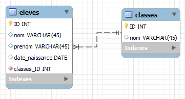

# Base de données

## Création avec Workbench

 <!-- .element width="30%" align="left" -->

 <!-- .element width="30%" align="right" -->

----

## Création de tables

### Définition de Schéma

- **Schéma** : Structure de la base de données
- MySQL Workbench permet la création de schéma graphiquement
- On pourra y définir :
    - Les tables
    - Les colonnes
    - Les types de données
    - Les contraintes
    - Les relations
    - ...

----

## Création de tables

### Exemple de schéma



> Nous allons le créer ensemble !

----

## Création de tables

### La table élève

Démonstration !

Note: ./Espace Formateur/01_Diagram.md

----

## Création de tables

### Le code généré par Workbench

```mysql
SET @OLD_UNIQUE_CHECKS = @@UNIQUE_CHECKS, UNIQUE_CHECKS = 0;
SET @OLD_FOREIGN_KEY_CHECKS = @@FOREIGN_KEY_CHECKS, FOREIGN_KEY_CHECKS = 0;
SET @OLD_SQL_MODE = @@SQL_MODE,
    SQL_MODE =
            'ONLY_FULL_GROUP_BY,STRICT_TRANS_TABLES,NO_ZERO_IN_DATE,NO_ZERO_DATE,ERROR_FOR_DIVISION_BY_ZERO,NO_ENGINE_SUBSTITUTION';

CREATE SCHEMA IF NOT EXISTS `school` DEFAULT CHARACTER SET utf8mb4;
USE `school`;

CREATE TABLE IF NOT EXISTS `school`.`eleves`
(
    `ID`             INT UNSIGNED NOT NULL AUTO_INCREMENT,
    `nom`            VARCHAR(45)  NOT NULL,
    `prenom`         VARCHAR(45)  NOT NULL,
    `date_naissance` DATE         NOT NULL,
    PRIMARY KEY (`ID`)
)
    ENGINE = InnoDB;


SET SQL_MODE = @OLD_SQL_MODE;
SET FOREIGN_KEY_CHECKS = @OLD_FOREIGN_KEY_CHECKS;
SET UNIQUE_CHECKS = @OLD_UNIQUE_CHECKS;
```

----

## Création de tables

### Les options des colonnes

- `PK` : Primary Key - Indexe la colonne et la rend unique
- `NN` : Not Null - Empêche la colonne d'être vide
- `UQ` : Unique - Empêche la colonne d'avoir des doublons
- `BIN` : Binary - Stocke les données en binaire (images, etc.)
- `UN` : Unsigned - Empêche la colonne d'avoir des valeurs négatives

----

## Création de tables

### Les options des colonnes

- `ZF` : Zero Fill - Rempli les valeurs manquantes avec des zéros
- `AI` : Auto Increment - Incrémente automatiquement la valeur
- `G` : Generated Column - Génère la valeur automatiquement
- `Default/Expression` : Valeur par défaut ou expression (fonction, calcul, etc.)

----

## Création de tables

### Bonnes pratiques 

- Pas d'espace dans les noms de colonne : des `_`
- Pas de majuscules dans les noms de colonne
- Pas de mots réservés (ex : `date`, `order`, `group`, etc.)
- Pas de caractères spéciaux (ex : `é`, `è`, `ç`, etc.)
- Utiliser des noms de colonnes explicites (pas d'ab'éviation)
- Préférer le singulier au pluriel !

---

# Base de données

## Commandes de base


 <!-- .element width="30%" align="left" -->

 <!-- .element width="30%" align="right" -->

----

## Commandes de base

### Syntaxe des exemples

Les exemples utiliseront la syntaxe suivante :

- `[]` : Indique un paramètre facultatif
- `<>` : Indique un paramètre obligatoire

----

## Commandes de base

### Bonnes pratiques : syntaxe

- Mots clefs en `MAJUSCULES`
- Noms de tables et colonnes en `minuscules`
- Les instructions se terminent par `;`
- Les commandes peuvent être placées sur plusieurs lignes pour plus de lisibilité

----

## Commandes de base

### Insérer un élément

```mysql
INSERT INTO [bdd].<table> (<colonne1>, <colonne2>, ...) VALUES (<valeur1>, <valeur2>, ...);
```

- Lorsque la BDD est sélectionnée, il n'est pas nécessaire de préciser le nom de la BDD.
- Conservez toutefois cette bonne pratique !

----

## Commandes de base

### Insérer un élément

```mysql
INSERT INTO school.eleves VALUES (1, 'David', 'Bowie', '1947-01-08');
```

- Cette syntaxe n'est pas pratique car elle oblige à respecter l'ordre des colonnes
- Nous en verrons une autre plus tard

----

## Commandes de base

### Selectionner des éléments

```mysql
SELECT <colonne1>, <colonne2>, ... FROM [bdd].<table>;
```

> Taper `*` pour sélectionner toutes les colonnes.

----

## Commandes de base

### Sélectionner des éléments

```mysql
SELECT * FROM school.eleves;
```

> Utiliser le `*` est utile, mais c'est une mauvaise pratique !

----

## Commandes de base

### Sélectionner des éléments

> Pourquoi '*' est-il une mauvaise pratique ?

- Il est préférable de sélectionner uniquement les colonnes dont on a besoin
- Cela permet de réduire la taille des données renvoyées
- Cela permet de réduire le temps de traitement de la requête

----

## Commandes de base

### A vous de jouer

Sélectionnez uniquement les colonnes `nom` et `prenom` de la table `eleves`

```mysql
SELECT <colonne1>, [colonne2] 
FROM [bdd].<table>;
```

----

## Commandes de base

### A vous de jouer

```mysql
SELECT nom, prenom 
FROM school.eleves;
```

----

## Commandes de base

### Insérer un élément

```mysql
INSERT INTO school.eleves 
VALUES (1, 'Elton', 'John', '1947-03-25');
```

> Tapez cette commande et vous aurez une erreur. Pourquoi ?

----

## Commandes de base

### Insérer un élément

- L'ID `1` est déjà utilisé
- S'agissant d'une clé primaire, elle doit être unique !
- C'est pourquoi il est préférable de ne pas la renseigner

----

## Commandes de base

### Insérer un élément

```mysql
INSERT INTO school.eleves (nom, prenom, date_naissance)
VALUES ('Elton', 'John', '1947-03-25');
```

- On peut préciser les noms des colonnes pour ne pas avoir à respecter l'ordre !
- On devra respecter l'ordre précisé entre parenthèses
- On est pas obligé de préciser toutes les colonnes

----

## Commandes de base

### Insérer plusieurs éléments

Il est possible de séparer les éléments par des virgules :

```mysql
INSERT INTO school.eleves (nom, prenom, date_naissance)
VALUES ('Elton', 'John', '1947-03-25'),
       ('Norton', 'Edward', '1969-08-18'),
       ('Hendrix', 'Jimi', '1942-11-27'),
       ('Kilmister', 'Lemmy', '1945-12-24'),
       ('Nicks', 'Stevie', '1948-05-26');
```

> Ajoutez ces élèves à votre base de donnés !

---

## Commandes de base

### Modifier une table

> Quelques erreurs se seont glissées, les avez vous vu ?

----

## Commandes de base

### Modifier une table

- Les prénoms et noms de `David Bowie` et `Elton John` sont inversés
- Il y a une majuscule à `date_Naissance` au lieu de `date_naissance`

----

## Commandes de base

### Obtenir les informations d'une table

Cette commande permet d'obtenir les informations d'une table :

```mysql
DESCRIBE <table>;
```

> Tapez cette commande pour voir les informations de la table `eleves`

----

## Commandes de base

### Modifier une table

Syntaxe :
```mysql
ALTER TABLE [bdd].< table >
CHANGE
<ancion_nom> <nouveau_nom> <description>;
```

Exemple : 
```mysql
ALTER TABLE school.eleves
CHANGE COLUMN date_Naissance date_naissance DATE NULL;
```

> Changeons le nom de la colonne `date_Naissance` en `date_naissance`

---

## Commandes de base

### Modifier un élément

- Pour modifier un élément, nous devront d'abord filtrer les éléments à modifier
- Pour cela, nous utiliserons la commande `WHERE`
- On lui passera une condition

----

## Commandes de base

### Opérateurs de comparaison

En complément du mot cl

- `=` : Egal à
- `!=` : Différent de
- `>` : Supérieur à
- `<` : Inférieur à
- `>=` : Supérieur ou égal à
- `<=` : Inférieur ou égal à

----

## Commandes de base

### Modifier un élément

Le mot clef `SET` permet de modifier les valeurs d'une colonne :

```mysql
UPDATE [bdd].<table>
SET <colonne1> = <valeur1>, <colonne2> = <valeur2>, ...
WHERE <condition>;
```

- `SET` : Indique les colonnes à modifier
- `=` : Indique la valeur à affecter à la colonne
- `WHERE` : Indique les éléments à modifier

----

## Commandes de base

### Modifier un élément

> Qu'est-ce qu'il se passe si je ne précise pas de condition ?

----

## Commandes de base

### Modifier un élément

- Si on ne précise pas de condition, tous les éléments seront modifiés
- C'est pourquoi il est important de préciser une condition !

----

## Commandes de base

### Modifier un élément

Remettons les prénoms et noms dans le bon ordre :

```mysql
UPDATE school.eleves
SET prenom = 'David', nom = 'Bowie'
WHERE ID = 1;
```

> Cette commande est pratique, mais implique de connaitre l'ID de l'élève ...

---

## Commandes de base

### Filtrer avec LIKE

- L'opérateur `LIKE` permet de filtrer les éléments en fonction d'un motif
- Il est possible d'utiliser des caractères spéciaux, un peu comme des regex :
    - `%` : N'importe quel caractère
    - `_` : Un seul caractère

----

## Commandes de base

### Filtrer avec LIKE

```mysql
SELECT * FROM school.eleves
WHERE prenom LIKE 'D%';
```

> Ne sélectionne que les élèves dont le prénom commence par `D`

----

## Commandes de base

### Filtrer avec LIKE

- `%a%` : contient un `a`
- `d_` : contient un `d` suivi d'un caractère
- `d%` : commence par `d`
- `%d` : finit par `d`
- `b___e` : contient un `b` suivi de 3 caractères puis un `e`

----

## Commandes de base

### Filtrer avec LIKE

A vous de jouer !

> Utilisez le filtre pour inverser nom et prénom d'Elton John.

Rappel de la syntaxe : 

```mysql
UPDATE [bdd].<table>
SET <colonne1> = <valeur1>, <colonne2> = <valeur2>, ...
WHERE <condition>;
```

----

## Commandes de base

### Filtrer avec LIKE

```mysql
UPDATE school.eleves
SET prenom = 'John', nom = 'Elton'
WHERE prenom LIKE 'Elton';
```

> Workbench nous retourne une erreur, pourquoi ?

----

## Commandes de base

### Filtrer avec LIKE

- Le `Safe mode` de Workbench empêche les modifications de données
- Il est préférable de toujours utiliser des ID pour les modifications
- En effet, rien ne nous garantit que le filtre ne renverra qu'un seul élément !

> Nous allons le désactiver pour le moment, mais il est préférable de le laisser activé !

----

## Commandes de base

### Filtrer sur plusieurs critères

```mysql
SELECT <colonne1>, <colonne2>, ... FROM [bdd].<table>
WHERE <condition1> 
    AND <condition2> 
    OR ...;
```

- `AND` : ET
- `OR` : OU
- `NOT` : NON
- `XOR` : OU exclusif

----

## Commandes de base

### Filtrer sur plusieurs critères

On peut aussi utiliser des parenthèses pour grouper les conditions :

```mysql
SELECT *
FROM <nom_table>
WHERE colonne1 > 'valeur1'
    OR (colonne2 = 'valeur2' AND colonne3 = 'valeur3');
```

> Pratique mais peu lisibles, à utiliser avec parcimonie !

----

## Commandes de base

### A vous de jouer !

```mysql
SELECT * FROM <nom table>
WHERE <condition1> AND <condition2>
    OR (<condition3> AND <condition4>);
```

Filtrez les élèves : 
- Nés après 1945
- Dont le nom ne contient pas de `e` **et** pas de `k`
- Dont le prénom contient un `n`

----

## Commandes de base

### A vous de jouer !

```mysql
SELECT nom, prenom, date_naissance
FROM school.eleves
WHERE date_naissance > '1945-12-31'
    AND prenom NOT LIKE '%e%' AND prenom NOT LIKE '%k%'
    AND prenom LIKE '%n%';
```

> Réponse : Elton John

----

## Commandes de base

### A vous de jouer

```mysql
SELECT *
FROM nom_table
WHERE colonne BETWEEN 'valeur1' AND 'valeur2';
```

Affichez les élèves nés entre le 01/01/1945 et le 31/12/1947

----

## Commandes de base

### A vous de jouer

```mysql
SELECT *
FROM school.eleves
WHERE date_naissance BETWEEN '1945-01-01' AND '1947-12-31';
```

----

## Commandes de base

### A vous de jouer

Réponses :
- David Bowie
- Lemmy Kilmister
- Elton John

----

## Commandes de base

### Filtrer à partir d'une liste

- Plutôt que d'enchainer les `OR`, on peut utiliser `IN`

```mysql
SELECT *
FROM nom_table
WHERE colonne IN ('valeur1', 'valeur2', ...);
```

- `IN` : Dans la liste
- `NOT IN` : Pas dans la liste

----

## Commandes de base

### Filtrer à partir d'une liste

```mysql
SELECT *
FROM school.eleves
WHERE nom IN ('Bowie', 'Kilmister', 'John');
```

---

# La suite !

[Index](index.html)