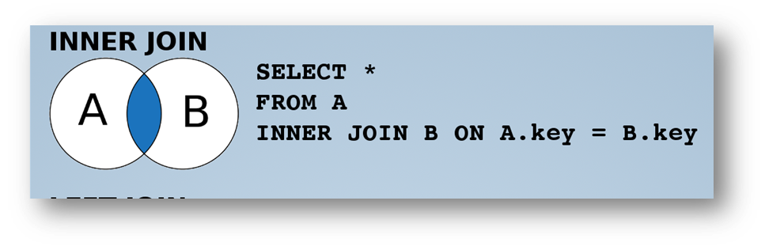
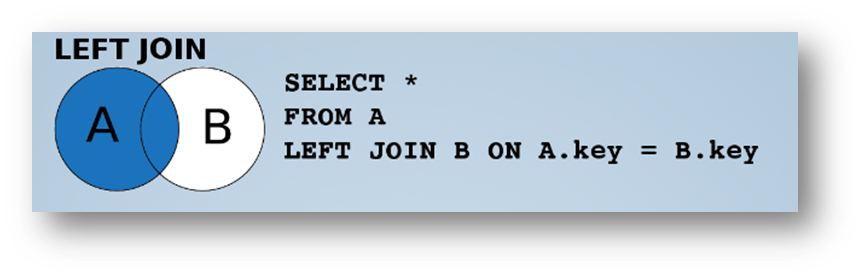
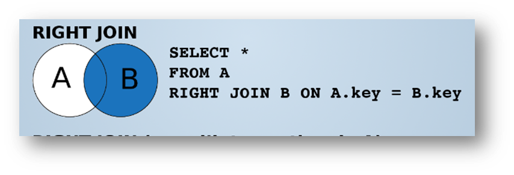

# SQL : Jointures

 <!-- .element width="30%" align="left" -->

 <!-- .element width="30%" align="right" -->


----

## Définition

- Une jointure permet de lier deux tables entre elles
- On peut ainsi récupérer des informations de plusieurs tables en une seule requête
- On utilise les **clés primaires** et **clés étrangères** pour lier les tables

----

## Clef primaire

- Une clef primaire est un identifiant unique pour une table
- Elle sert également d'index pour la table : accélère les recherches
- Elle est généralement de type `INT` et auto-incrémentée

> Elle peut aussi être auto-générée, sans incrément

----

## Clef primaires

### Bonnes pratiques

- Une PK doit être neutre et ne pas avoir de sens (pas de nom, prénom, etc.)
- Une clef primaire ne peut pas être `NULL`
- Une clef primaire ne peut pas être modifiée
- Elle doit être unique et toujours positive

----

## Clef étrangère

- Une clef étrangère est une référence à une clef primaire d'une autre table
- Elle permet de lier deux tables entre elles
- Elle peut être `NULL` si la relation n'est pas obligatoire

----

## Clef étrangère

### Exemple

- Michel a un ID de 1. Il est donc `8` dans la table `eleves`
- Son carnet de notes est stocké dans la table `notes` et a pour ID `3`
- La table `notes` contient une clef étrangère `eleve_id` qui fait référence à la table `eleves`
- La clef étrangère `eleve_id` de la table `notes` vaut donc `1`, pour désigner Michel

----

## Démonstration

Améliorons notre BDD avec la table `classes`

----

## Question !

> Comment récupérer en une seule commande les ID de David Bowie et Elton John ?

----

## Récupérer les ID

```mysql
SELECT id, nom
FROM eleves
WHERE nom IN ('Bowie', 'John')
```

----

## Question !

> Quelle commande pour update les élèves, en une seule commande ?

----

## Update des élèves

```mysql
UPDATE eleves
SET classe_id = 6
WHERE id IN (x, y)
```

> `x` et `y` sont les ID récupérés précédemment

----

## A vous de jouer !

Mettes à jour les élèves suivants :

- Edward Norton est en 5ème,
- Stevie Nicks est en 4ème,
- Lemmy Kilminster est en 3ème.
- Jimmy Hendrix est en 3ème.

---

## Types de jointure

Il existe plusieurs types de jointures.
Nous allons aborder les plus courantes :

- `INNER JOIN` : jointure interne
- `LEFT JOIN` : jointure externe gauche
- `RIGHT JOIN` : jointure externe droite

> Il en existe d'autres, qui ne seront pas abordées ici.

----

## Fonctionnement global

- La table d'origine est celle qui est précisée en premier
- Elle est lue, puis la table à joindre est lue
- En fonction du type de jointure, les éléments sont retournés ou non dans une **table virtuelle**

----

## Mais avant !

Ajoutons un élèves sans classe pour illustrer nos propos.

```mysql
INSERT INTO eleves (nom, prenom, date_naissance)
VALUES ('Hudson', 'Saul', '1965-07-23');
```

> C'est Slash, le guitariste de Guns N' Roses

---

## Jointure interne

### INNER JOIN

 <!-- .element width="50%" -->

- Ne retournera que les éléments **communs aux deux tables**
- La jointure la plus commune

----

## Jointure interne

### INNER JOIN

```mysql
SELECT table.colonne1, table.colonne2, table.colonne3
FROM table1
         INNER JOIN table2 ON table1.clef = table2.clef
```

- On peut afficher les colonnes de l'une ou de l'autre, mais il faut préciser la table
- On peut utiliser un alias pour les tables/colonnes
- On doit choisir une table d'origine (ici `table1`)
- Il faut préciser quelles colonnes sont utilisées pour la jointure

----

## Jointure interne

### INNER JOIN

```mysql
# Afficher les colonnes en précisant l'origine
SELECT *
# Préciser la table d'origine
FROM eleves
# Préciser le nom de la table à joindre
         INNER JOIN classes
    # Préciser de chaque côté la colonne à utiliser pour la jointure
    # En commençant par la table d'origine
                    ON eleves.classe_id = classes.id
```

> Cette commande ne respecte pas les bonnes pratiques. Pourquoi ?

----

## Jointure interne

### INNER JOIN

```mysql
SELECT eleves.nom    AS Nom,
       eleves.prenom AS Prénom,
       classes.nom   AS Classe,
       classes.annee AS Promotion
FROM eleves
         INNER JOIN classes
                    ON eleves.classe_id = classes.id
```

> Il est préférable de préciser les tables et les colonnes. Idéalement avec un alias.

----

## Jointure interne

### INNER JOIN

> Saul Hudson n'est pas dans la liste. Pourquoi ?

----

## Jointure interne

### INNER JOIN

- Il est bien dans la table `eleves`
- Mais il n'a pas de classe, sa colonne `classe_id` vaut `NULL`
- Il n'est donc pas retourné par la jointure
- Pour l'afficher, il faut utiliser une **jointure externe** !

---

## Jointure externe gauche

### LEFT JOIN

 <!-- .element width="50%" -->

- Retourne tous les éléments de la table de gauche
- Les éléments sans correspondance dans la table de droite auront des valeurs `NULL`

----

## Jointure externe gauche

### LEFT JOIN

```mysql
SELECT table1.colonne1, table1.colonne2, table2.colonne1
FROM table1
         LEFT JOIN table2 ON table1.clef = table2.clef
```

- Les règles concernant les alias et les colonnes sont les mêmes que pour `INNER JOIN`
- On peut utiliser `LEFT OUTER JOIN` à la place de `LEFT JOIN`

----

## Jointure externe gauche

### LEFT JOIN

```mysql
SELECT eleves.nom    AS Nom,
       eleves.prenom AS Prénom,
       classes.nom   AS Classe,
       classes.annee AS Promotion
FROM eleves
         LEFT JOIN classes
                   ON eleves.classe_id = classes.id
```

> Saul Hudson est bien retourné, mais sa classe est `NULL` car il n'a aucune classe !

----

## Jointure externe gauche

### Sans intersection

On peut taper la commande suivante pour voir les éléments qui n'ont pas de correspondance dans la table de droite :

```mysql
SELECT eleves.nom    AS Nom,
       eleves.prenom AS Prénom,
       classes.nom   AS Classe,
       classes.annee AS Promotion
FROM eleves
         LEFT JOIN classes
                   ON eleves.classe_id = classes.id
WHERE classes.id IS NULL
```

> On parle de **jointure externe gauche sans intersection**

---

## Jointure externe droite

### RIGHT JOIN

 <!-- .element width="50%" -->

- Retourne tous les éléments de la table de droite
- Les éléments sans correspondance dans la table de gauche auront des valeurs `NULL`

----

## Jointure externe droite

## Préparation

Ajoutez une classe de seconde pour l'année 2025 avec l'ID `2`

----

## Jointure externe droite

### Préparation

```mysql
INSERT INTO classes (id, nom, annee)
VALUES (2, 'Seconde', 2025);
```

----

## Jointure externe droite

### RIGHT JOIN

```mysql
SELECT table1.colonne1, table1.colonne2, table2.colonne1
FROM table1
         RIGHT JOIN table2 ON table1.clef = table2.clef
```

- Les règles concernant les alias et les colonnes sont les mêmes que pour `INNER JOIN`
- On peut utiliser `RIGHT OUTER JOIN` à la place de `RIGHT JOIN`

----

## Jointure externe droite

### RIGHT JOIN

```mysql
SELECT eleves.nom    AS Nom,
       eleves.prenom AS Prénom,
       classes.nom   AS Classe,
       classes.annee AS Promotion
FROM eleves
         RIGHT JOIN classes
                    ON eleves.classe_id = classes.id
```

> Cette fois, c'est la classe de seconde qui n'a pas d'élèves !

----

## Jointure externe droite

### Question

Si on retape la commande avec une jointure par la gauche, que se passe-t-il ?

----

## Jointure externe droite

### Réponse

```mysql
SELECT eleves.nom    AS Nom,
       eleves.prenom AS Prénom,
       classes.nom   AS Classe,
       classes.annee AS Promotion
FROM eleves
         LEFT JOIN classes
                   ON eleves.classe_id = classes.id
```

> La classe de seconde n'est pas retournée, car elle n'a pas d'élèves !

----

## Jointure externe droite

### Sans intersection

On peut taper la commande suivante pour voir les éléments qui n'ont pas de correspondance dans la table de gauche :

```mysql
SELECT eleves.nom    AS Nom,
       eleves.prenom AS Prénom,
       classes.nom   AS Classe,
       classes.annee AS Promotion
FROM eleves
         RIGHT JOIN classes
                    ON eleves.classe_id = classes.id
WHERE eleves.id IS NULL
```

> On parle de **jointure externe droite sans intersection**

---

# Gestion des dates

 <!-- .element width="30%" align="left" -->

 <!-- .element width="30%" align="right" -->

----

## Gestion des dates

### Introduction

- Les dates sont stockées dans des colonnes de type `DATE`
- Elles sont au format `YYYY-MM-DD`
- Il existe de **nombreuses** fonctions pour manipuler les dates
- Elles prennent en paramètre une date ou une colonne de type `DATE`

----

## Gestion des dates

### Fonctions courantes : les heures

- `HOUR()` : retourne l'heure
- `MINUTE()` : retourne les minutes
- `SECOND()` : retourne les secondes
- `TIME()` : retourne l'heure au format `HH:MM:SS`

> `TIME()` fonctionne aussi avec un type `DATETIME`

----

## Gestion des dates

### Fonctions courantes : les jours

- `DAY()` : retourne le jour du mois
- `DAYNAME()` : retourne le nom du jour
- `DAYOFWEEK()` : retourne le jour de la semaine (1 à 7)
- `WEEDAY()` : retourne le jour de la semaine (0 à 6)
- `DAYOFYEAR()` : retourne le jour de l'année (0 à 365)

----

## Gestion des dates

### Fonctions courantes : les semaines

- `WEEK()` : retourne le numéro de la semaine
- `WEEKOFYEAR()` : retourne le numéro de la semaine
- `YEAROFWEEK()` : retourne le numéro de la semaine

----

## Gestion des dates

### Fonctions courantes : les mois/années

- `MONTH()` : retourne le mois
- `MONTHNAME()` : retourne le nom du mois
- `YEAR()` : retourne l'année

----

## Gestion des dates

### Formater une date

`DATE_FORMAT(date, format)` : formate une date

Exemple :

````mysql
SELECT DATE_FORMAT(NOW(), 'Nous sommes le %e %M de l\'année %Y, il est %l heures et %i minutes.') AS Today
````

----

- `%e` : jour du mois, sans le 0
- `%W` : nom du jour
- `%c` : mois, de 0 à 12
- `%M` : nom du mois
- `%Y` : année sur 4 chiffres
- `%T` : heure au format `HH:MM:SS`
- `%l` ou `%k` : heure en 12 ou 24h
- `%i` ou `%s` : minutes et secondes

Note: Il y en a encore BEAUCOUP d'autres !

----

## Gestion des dates

### Formater une date

```mysql
SELECT DATE_FORMAT(date_naissance, '%e %M %Y') AS 'Date de naissance',
       nom,
       prenom
FROM eleves
```

> Affiche la date de naissance au format `1er janvier 2021`

----

## Gestion des dates

### DATEDIFF

`DATEDIFF(date1, date2)` : retourne le nombre de jours entre deux dates

```mysql
SELECT DATEDIFF(NOW(), '1992-07-20') AS Diff
```

> Affiche le nombre de jours entre aujourd'hui et ma date de naissance

----

## Gestion des dates

### TIMEDIFF et TIMESTAMPDIFF

- `TIMEDIFF(date1, date2)` : retourne la différence entre deux dates
- `TIMESTAMPDIFF(unité, date1, date2)` : retourne la différence entre deux dates, en fonction de l'unité

```mysql
SELECT TIMEDIFF(NOW(), '1992-07-20 16:45:00')   AS Heures,
       TIMESTAMPDIFF(YEAR, '1992-07-20', NOW()) AS Age
```

> Maintenant, je me sens vieux...

----

## Gestion des dates

### DATE_ADD et DATE_SUB

- `DATE_ADD(date, INTERVAL valeur unité)` : ajoute une valeur à une date
- `DATE_SUB(date, INTERVAL valeur unité)` : soustrait une valeur à une date

```mysql
SELECT DATE_ADD(NOW(), INTERVAL 1 DAY) AS 'Demain',
       DATE_SUB(NOW(), INTERVAL 1 DAY) AS 'Hier'
```

---

# A vous de jouer !

Réalisez la première partie du TP Beer !

---

## La suite !

[Index](index.html)