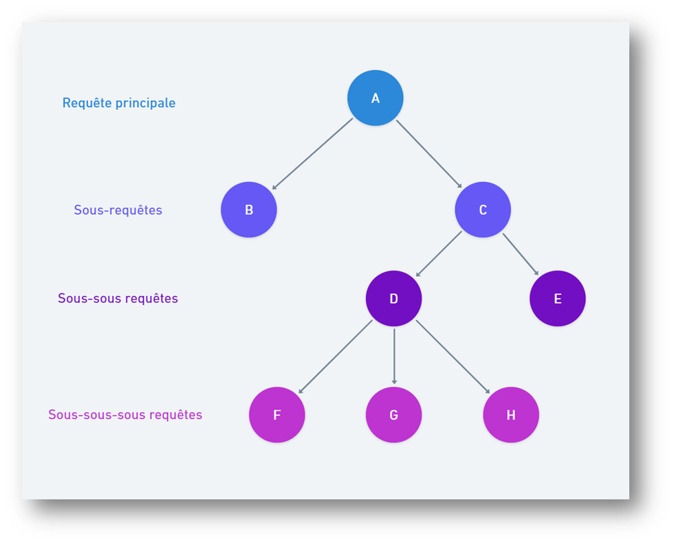

# SQL : Sous requêtes

 <!-- .element width="30%" align="left" -->

 <!-- .element width="30%" align="right" -->

----

## Sous requêtes

### Définition

- Une sous-requête est une requête SQL imbriquée dans une autre requête SQL.

- Elle peut être utilisée dans une clause `WHERE`, `FROM`, `SELECT`, `INSERT`, `UPDATE` ou `DELETE`.

- Peut aussi servir à réaliser plusieurs opérations en une seule requête.

---

## Sous requêtes

### Dans le WHERE

- La sous-requête est exécutée en premier.

- Elle ne retourne qu'une seule ligne

- On utilise le résultat de la sous-requête dans une clause `WHERE`.

----

## Sous requêtes

### Dans le WHERE

```mysql [6-9 | ]
-- Requête principale
SELECT nom,
       prenom
FROM eleves
WHERE classe_id =
-- Sous requête
      (SELECT id
       FROM classes
       WHERE nom LIKE 'Troisième');
```

----

## Sous requêtes

### En etapes

```mysql
SELECT id
FROM classes
WHERE nom LIKE 'Troisième'
```

> Dans notre cas, retourne `3`

----

## Sous requêtes

### En etapes

```mysql
SELECT nom,
       prenom
FROM eleves
WHERE classe_id = 3
```

> Où 3 est le **résultat** de la sous requête

----

## Sous requêtes

### Equivalent avec jointure

```mysql
SELECT eleves.nom,
       eleves.prenom
FROM eleves
         LEFT JOIN classes
                   ON eleves.classe_id = classes.id
WHERE classes.nom LIKE 'Troisième';
```

----

## Sous requêtes

### Jointure ou sous requête ?

- Il faut favoriser les **jointures**

- Une sous requête est plus lente qu'une jointure

> Essayez avec `EXPLAIN` pour voir la différence !

----

## Sous requêtes

### Et si j'ai plusieurs résultats ?

- Si on a besoin de plusieurs résultats, on utilise le mot clef `IN`

```mysql
-- Requête principale
SELECT nom,
       prenom
FROM eleves
WHERE classe_id IN (
    (SELECT id
     FROM classes
     WHERE nom IN ('Troisième', 'Quatrième')))
```

----

## Sous requêtes

### Et si j'ai plusieurs résultats ?

- On peut aussi utiliser `ANY`

```mysql
SELECT nom,
       prenom
FROM eleves
WHERE classe_id = ANY ((SELECT id
                        FROM classes
                        WHERE nom IN ('Troisième', 'Quatrième')))
```

----

## Sous requêtes

### Et si j'ai plusieurs résultats ?

Et pour faire une comparaison avec **tous** les résultats, on utilise `ALL`

```mysql
SELECT nom,
       prenom
FROM eleves
WHERE classe_id > ALL ((SELECT id
                        FROM classes
                        WHERE nom IN ('Troisième', 'Quatrième')))
```

> On retour les élèves dont l'ID est supérieur à tous les ID des classes de troisième et quatrième

---

## Sous requêtes

### Sous requête corrélée

- Fait référence à une colonne non reprise dans le `FROM`, mais présente ailleurs

- La sous requête seule ne pourra pas être exécutée

----

## Sous requêtes

### Sous requête corrélée

Ici, on cherche à vérifier si un élève est dans une classe de troisième.

```mysql [3-5 | 0]
SELECT classes.id, classes.nom FROM classes
WHERE EXISTS (
    -- Ne pourra pas être exécutée seule
    SELECT * FROM eleves
    WHERE classes.nom = 'Troisième'
)
```

> NB : cette requête est purement illustrative !

----

## Sous requêtes

### Sous requête corrélée

 <!-- .element width="50%" align="left" -->

Les requêtes corrélées peuvent accéder uniquement aux niveaux supérieurs ! Jamais en dessous ni au même niveau !

----

## Sous requêtes

### Dans le FROM

On est un peu limité avec notre table `eleves`. Vous aurez l'occasion de pratiquer avec la base `beer` dans les
exercices.

---

## Sous requêtes

### Dans le FROM

- La sous-requête est exécutée en premier.

- Son résultat va servir de table pour la requête principale.

- On réalise une requête sur la table virtuelle créée par la sous-requête.

> Ca ne vous fait pas penser à quelque chose ?

----

## Sous requêtes

### Dans le FROM

```mysql [0 | 7-15 | 14-15 | 3-5, 15 | 16-18 ]
-- Liste des colonnes à afficher
-- Doit faire référence à l'alias de la sous requête
SELECT eleves_avant_1950.nom,
       eleves_avant_1950.prenom,
       classes.nom
FROM (
-- Sous requête
         SELECT eleves.nom,
                eleves.prenom,
                eleves.date_naissance,
                eleves.classe_id
         FROM eleves
         WHERE YEAR(date_naissance) < 1950
         -- Doit avoir un alias
     ) AS `eleves_avant_1950`
         LEFT JOIN
     classes ON classe_id = classes.id
WHERE classes.nom LIKE 'Sixième';
```

----

## Sous requêtes

### Equivalent avec une vue

```mysql [1-8 | 10-17]
-- Création de la vue
CREATE VIEW `eleves_avant_1950` AS
SELECT eleves.nom,
       eleves.prenom,
       eleves.date_naissance,
       eleves.classe_id
FROM eleves
WHERE YEAR(date_naissance) < 1950;
```

```mysql
-- Utilisation de la vue
SELECT eleves_avant_1950.nom,
       eleves_avant_1950.prenom,
       classes.nom
FROM eleves_avant_1950
         LEFT JOIN classes
                   ON classe_id = classes.id
WHERE classes.nom LIKE 'Sixième';
```

---

## En bonus

### Union

`UNION` permet de mettre à la suite les résultats de deux requêtes

```mysql
SELECT ...
UNION [ DISTINCT | ALL ]
SELECT ...
```

- `DISTINCT` : supprime les doublons (par défaut)
- `ALL` : garde les doublons

**NB : Les deux requêtes doivent avoir le même nombre de colonnes**

---

# A vous de jouer !

Réaliser le TP 3 sur la base `beer`

