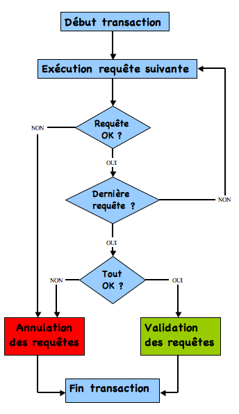

# SQL : Transactions

 <!-- .element width="30%" align="left" -->

 <!-- .element width="30%" align="right" -->

----

## Transactions

### Définition

- Une transaction est une suite d'opérations qui doit être exécutée dans son intégralité ou pas du tout.

- L'idée étant de tout annuler si une des étapes échoue.

----

## Transactions

### Exemple

Si je veux réaliser un virement bancaire, il faut :
1. Vérifier que j'ai assez d'argent sur mon compte
2. Débiter mon compte
3. Créditer le compte du bénéficiaire

> Que se passerait-il en cas de coupure de courant entre l'étape 2 et 3 ?

----

## Transactions

### Exemple

- Je serais débité mais le bénéficiaire ne serait pas crédité.

> Où est l'argent ?!

----

## Transactions

### Solution

- Les transactions sont là pour résoudre ce genre de problèmes

- On va réaliser les trois étapes sans les valider

- Si tout se passe bien, on valide la transaction

- Sinon, on annule toutes les opérations

----

## Transactions

### En image



----

## Transactions

### Les commits

- Comme pour Git, un `COMMIT` valide les opérations

- Sur un script SQL, il commit automatiquement à la fin du script

```mysql
-- Désactiver les autocommits
SET AUTOCOMMIT = 0;
```

> Les données sont tout de même présentes dans la base de données, mais elles ne sont pas validées

----

## Transactions

### Les Rollbacks

- `ROLLBACK` annule les opérations qui n'ont pas été commités

- On peut rollback une transaction en cours

- On peut rollback un script SQL

```mysql
-- Annuler les opérations
ROLLBACK;
```

----

## Transactions

### Petit test

Ajoutons un article dans la table `eleves`: 

```mysql
INSERT INTO eleves (nom, prenom, date_naissance)
VALUES ('Devos', 'Alexandre', '1992-07-20')
```

Vérifions :

```mysql
SELECT * FROM eleves;
ROLLBACK;
SELECT * FROM eleves;
```

----

## Transactions

### ROLLBACK

- Finalement, un rollback est un `ctrl + z` sur la base de données.

- Il remet la BDD tel qu'elle était eu dernier commit !

> Quel serait la commande Git équivalente ?

Note: `git stash`

----

## Transactions

### Essayons de valider

```mysql
INSERT INTO eleves (nom, prenom, date_naissance)
VALUES ('Devos', 'Alexandre', '1992-07-20');
COMMIT;
ROLLBACK;
```

----

## Avant de passer à la suite

Pensez à réactiver les autocommits :

```mysql
SET AUTOCOMMIT = 1;
```

---

## Transactions

### Les transactions en SQL

- Plutôt que de désactiver les autocommits, on peut utiliser les transactions

- Cela évite d'oublier de les réactiver !

- On termine une transaction avec `COMMIT` ou `ROLLBACK`

```mysql
START TRANSACTION;
-- Requêtes
COMMIT;
```

----

## Transactions

### Les savepoints

- On peut créer des points de sauvegarde dans une transaction

- On peut revenir à un savepoint avec `ROLLBACK TO`

```mysql
START TRANSACTION;
-- Requêtes
SAVEPOINT savepoint1;
-- Requêtes
SAVEPOINT savepoint2;
-- Requêtes
ROLLBACK TO savepoint1;
-- Requêtes
COMMIT;
```

----

## Transactions

### Validations implicites

Certains éléments valident automatiquement une transaction :
- `CREATE TABLE`, `DROP TABLE`, 
- `CREATE INDEX`, `DROP INDEX`, 
- `ALTER TABLE`, `RENAME TABLE`, 
- `TRUNCATE TABLE`, `LOCK TABLES`, `UNLOCK TABLES`

> Globalement, tout ce qui influe sur la structure de la base de données !

----

## Transactions

### Validations implicites

- Il n'est pas possible de créer une transaction dans une transaction

- En réalité `START TRANSACTION` commite la transaction en cours avant d'en créer une nouvelle !

---

## Retour à l'index

[Index](index.html)